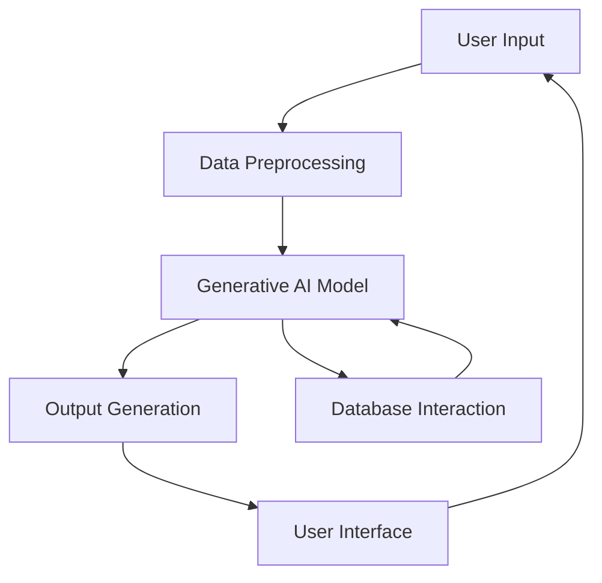

```markdown
# NATNOT---Generative-AI
> Unleash the Power of Generative AI for Creative Solutions


## Overview
NATNOT---Generative-AI is a cutting-edge project that leverages the capabilities of generative artificial intelligence to provide innovative solutions across various domains. Whether you're looking to generate text, images, or other creative content, this project aims to harness AI's potential to meet your needs.

## Architecture & Workflow

At the core of NATNOT is a sophisticated architecture that integrates machine learning models, data processing pipelines, and user interfaces. The system is designed to be scalable, efficient, and user-friendly.



## Granular Tech Stack
- **Languages**: Python
- **Frameworks**: TensorFlow, PyTorch
- **Libraries**: NumPy, Pandas, Matplotlib
- **Tools**: Jupyter Notebook, Git

## Key Features
- 🌟 Advanced generative AI models
- 🚀 Scalable architecture for handling large datasets
- 🎨 Versatile output generation (text, images, etc.)
- 🔄 Real-time data processing and feedback loop
- 📈 Seamless integration with user interfaces

## Project Structure
```
NATNOT---Generative-AI/
│
├── 3_NATNOT.ipynb
├── README.md
```

## Getting Started

### Prerequisites
- Python 3.8+
- Virtual environment tools (e.g., venv or conda)

### Installation
1. Clone the repository:
   ```bash
   git clone https://github.com/yourusername/NATNOT---Generative-AI.git
   cd NATNOT---Generative-AI
   ```
2. Set up a virtual environment:
   ```bash
   python3 -m venv venv
   source venv/bin/activate  # On Windows use `venv\Scripts\activate`
   ```
3. Install dependencies:
   ```bash
   pip install -r requirements.txt
   ```

### Running the Project
To start using NATNOT, run the Jupyter Notebook:
```bash
jupyter notebook 3_NATNOT.ipynb
```

## Usage
- Open the Jupyter Notebook and follow the instructions to input your data.
- Adjust model parameters as needed to customize the output.
- Review the generated content directly in the notebook.

## Roadmap
- [ ] Expand model capabilities to include audio generation
- [ ] Develop a web-based user interface
- [ ] Implement additional AI models for enhanced creativity
- [ ] Optimize performance for large-scale deployments

## Contributing
We welcome contributions! Please fork the repository and submit a pull request with your changes. Ensure your code adheres to the project's coding standards.

## License
This project is licensed under the MIT License. See the [LICENSE](LICENSE) file for details.
```
